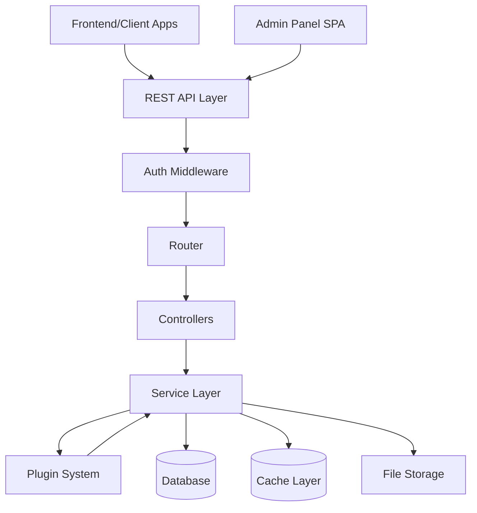

# Design Document: WordPress Alternative Framework

## Overview

Este framework es un BaaS (Backend as a Service) moderno diseñado para funcionar en servidores compartidos económicos mientras proporciona capacidades de desarrollo actualizadas para 2026. A diferencia de WordPress tradicional, este sistema está construido como un framework API-first con arquitectura desacoplada.

### Design Philosophy

- **API-First**: Todo el contenido y funcionalidad se expone mediante APIs RESTful
- **Lightweight**: Optimizado para funcionar con recursos limitados (256MB RAM, servidores compartidos)
- **Modern Stack**: PHP 8.1+, arquitectura moderna con autoloading PSR-4, dependency injection
- **Extensible**: Sistema de plugins y hooks similar a WordPress pero más estructurado
- **Developer-Friendly**: Documentación OpenAPI, cliente TypeScript, CLI tools

### Key Differentiators from WordPress

1. **No monolithic admin**: El admin panel es una aplicación separada que consume las APIs
2. **Stateless APIs**: Autenticación JWT, sin sesiones de servidor
3. **Modern PHP**: Aprovecha características de PHP 8.1+ (enums, readonly properties, attributes)
4. **Performance-first**: Caché integrado, lazy loading, optimizado para shared hosting

## Architecture

### High-Level Architecture



### Directory Structure

```
/
├── public/
│   ├── index.php          # Entry point
│   ├── .htaccess          # Apache rewrite rules
│   └── uploads/           # User uploaded files
├── src/
│   ├── Core/
│   │   ├── Application.php
│   │   ├── Container.php  # DI Container
│   │   ├── Router.php
│   │   └── Request.php
│   ├── Auth/
│   │   ├── JWTManager.php
│   │   ├── AuthMiddleware.php
│   │   └── PasswordHasher.php
│   ├── Content/
│   │   ├── ContentRepository.php
│   │   ├── ContentService.php
│   │   └── ContentController.php
│   ├── Database/
│   │   ├── Connection.php
│   │   ├── QueryBuilder.php
│   │   └── Migration.php
│   ├── Plugin/
│   │   ├── PluginManager.php
│   │   ├── HookSystem.php
│   │   └── PluginInterface.php
│   ├── Storage/
│   │   ├── FileManager.php
│   │   └── ImageProcessor.php
│   ├── Cache/
│   │   ├── CacheManager.php
│   │   └── CacheAdapter.php
│   └── Admin/
│       └── AdminController.php
├── plugins/               # User plugins
├── themes/               # User themes
├── config/
│   ├── app.php
│   ├── database.php
│   └── cache.php
├── migrations/           # Database migrations
├── cli/                  # CLI commands
└── vendor/              # Composer dependencies
```

### Request Lifecycle

1. **Entry**: Request hits `public/index.php`
2. **Bootstrap**: Application initializes, loads config, sets up DI container
3. **Routing**: Router matches request to controller action
4. **Auth**: Auth middleware validates JWT token if required
5. **Controller**: Controller receives request, delegates to service layer
6. **Service**: Business logic executes, interacts with repositories
7. **Plugins**: Hooks fire at various points, plugins can modify behavior
8. **Response**: JSON response returned to client

## Components and Interfaces

### Core Application

```php
class Application {
    private Container $container;
    private Router $router;
    private array $config;
    
    public function __construct(array $config);
    public function boot(): void;
    public function handle(Request $request): Response;
    public function registerServiceProviders(): void;
}
```

**Responsibilities**:
- Initialize dependency injection container
- Register service providers
- Bootstrap framework components
- Handle incoming requests

### Router

```php
class Router {
    private array $routes = [];
    private array $middleware = [];
    
    public function get(string $path, callable|array $handler): Route;
    public function post(string $path, callable|array $handler): Route;
    public function put(string $path, callable|array $handler): Route;
    public function delete(string $path, callable|array $handler): Route;
    public function group(array $attributes, callable $callback): void;
    public function match(Request $request): ?Route;
}
```

**Features**:
- RESTful route registration
- Route groups with shared middleware
- Parameter extraction from URLs
- Middleware pipeline

### Authentication System

```php
interface AuthInterface {
    public function authenticate(string $email, string $password): ?string;
    public function validateToken(string $token): ?User;
    public function refreshToken(string $token): ?string;
    public function revokeToken(string $token): bool;
}

class JWTManager implements AuthInterface {
    private string $secret;
    private int $ttl;
    
    public function generateToken(User $user): string;
    public function parseToken(string $token): array;
    public function isExpired(string $token): bool;
}
```

**Token Structure**:
```json
{
    "sub": "user_id",
    "email": "user@example.com",
    "role": "admin",
    "iat": 1234567890,
    "exp": 1234571490
}
```

### Content Management

```php
interface ContentRepositoryInterface {
    public function find(int $id): ?Content;
    public function findBySlug(string $slug): ?Content;
    public function findAll(array $filters = []): array;
    public function create(array $data): Content;
    public function update(int $id, array $data): Content;
    public function delete(int $id): bool;
}

class ContentService {
    public function __construct(
        private ContentRepositoryInterface $repository,
        private HookSystem $hooks,
        private CacheManager $cache
    ) {}
    
    public function getContent(int $id): ?Content;
    public function createContent(array $data): Content;
    public function updateContent(int $id, array $data): Content;
    public function deleteContent(int $id): bool;
}
```

**Content Types**:
- Post: Blog posts with title, content, author, date
- Page: Static pages
- Custom: User-defined content types via plugins

### Plugin System

```php
interface PluginInterface {
    public function register(): void;
    public function boot(): void;
    public function deactivate(): void;
}

class HookSystem {
    private array $actions = [];
    private array $filters = [];
    
    public function addAction(string $hook, callable $callback, int $priority = 10): void;
    public function doAction(string $hook, ...$args): void;
    public function addFilter(string $hook, callable $callback, int $priority = 10): void;
    public function applyFilters(string $hook, mixed $value, ...$args): mixed;
}

class PluginManager {
    public function loadPlugins(): void;
    public function activatePlugin(string $name): bool;
    public function deactivatePlugin(string $name): bool;
    public function getActivePlugins(): array;
}
```

**Hook Examples**:
- Actions: `content.created`, `user.login`, `plugin.activated`
- Filters: `content.render`, `api.response`, `query.where`

### Database Layer

```php
class QueryBuilder {
    public function table(string $table): self;
    public function select(array $columns = ['*']): self;
    public function where(string $column, mixed $value, string $operator = '='): self;
    public function join(string $table, string $first, string $second): self;
    public function orderBy(string $column, string $direction = 'asc'): self;
    public function limit(int $limit): self;
    public function get(): array;
    public function first(): ?array;
    public function insert(array $data): int;
    public function update(array $data): int;
    public function delete(): int;
}

class Migration {
    public function up(): void;
    public function down(): void;
}
```

**Security Features**:
- All queries use prepared statements
- Automatic parameter binding
- SQL injection prevention
- Transaction support with automatic rollback

### File Storage

```php
class FileManager {
    public function upload(UploadedFile $file, array $options = []): StoredFile;
    public function delete(string $path): bool;
    public function exists(string $path): bool;
    public function url(string $path): string;
    public function move(string $from, string $to): bool;
}

class ImageProcessor {
    public function resize(string $path, int $width, int $height): string;
    public function crop(string $path, int $width, int $height): string;
    public function generateThumbnails(string $path, array $sizes): array;
}
```

**File Organization**:
```
uploads/
├── 2026/
│   ├── 01/
│   │   ├── original-name-abc123.jpg
│   │   ├── original-name-abc123-150x150.jpg
│   │   └── original-name-abc123-300x300.jpg
```

### Cache System

```php
interface CacheAdapterInterface {
    public function get(string $key): mixed;
    public function set(string $key, mixed $value, int $ttl = 3600): bool;
    public function delete(string $key): bool;
    public function flush(): bool;
}

class CacheManager {
    private CacheAdapterInterface $adapter;
    
    public function remember(string $key, int $ttl, callable $callback): mixed;
    public function tags(array $tags): self;
    public function invalidate(string|array $tags): void;
}
```

**Cache Adapters**:
- APCu (preferred for shared hosting)
- Redis (if available)
- Memcached (if available)
- File-based (fallback)

### API Client (TypeScript)

```typescript
interface APIClientConfig {
    baseURL: string;
    token?: string;
    onTokenRefresh?: (token: string) => void;
}

class APIClient {
    constructor(config: APIClientConfig);
    
    // Content operations
    content: {
        list(filters?: ContentFilters): Promise<Content[]>;
        get(id: number): Promise<Content>;
        create(data: CreateContentData): Promise<Content>;
        update(id: number, data: UpdateContentData): Promise<Content>;
        delete(id: number): Promise<void>;
    };
    
    // Auth operations
    auth: {
        login(email: string, password: string): Promise<AuthResponse>;
        logout(): Promise<void>;
        refresh(): Promise<AuthResponse>;
        me(): Promise<User>;
    };
    
    // Media operations
    media: {
        upload(file: File, options?: UploadOptions): Promise<Media>;
        list(filters?: MediaFilters): Promise<Media[]>;
        delete(id: number): Promise<void>;
    };
}
```

## Data Models

### Content Model

```php
class Content {
    public readonly int $id;
    public string $title;
    public string $slug;
    public string $content;
    public ContentType $type;
    public ContentStatus $status;
    public int $authorId;
    public ?int $parentId;
    public array $customFields;
    public DateTime $createdAt;
    public DateTime $updatedAt;
    public ?DateTime $publishedAt;
    
    public function toArray(): array;
    public function toJson(): string;
}

enum ContentType: string {
    case POST = 'post';
    case PAGE = 'page';
    case CUSTOM = 'custom';
}

enum ContentStatus: string {
    case DRAFT = 'draft';
    case PUBLISHED = 'published';
    case SCHEDULED = 'scheduled';
    case TRASH = 'trash';
}
```

### User Model

```php
class User {
    public readonly int $id;
    public string $email;
    private string $passwordHash;
    public string $displayName;
    public UserRole $role;
    public array $meta;
    public DateTime $createdAt;
    public ?DateTime $lastLoginAt;
    
    public function hasPermission(string $permission): bool;
    public function can(string $action, ?object $resource = null): bool;
}

enum UserRole: string {
    case ADMIN = 'admin';
    case EDITOR = 'editor';
    case AUTHOR = 'author';
    case SUBSCRIBER = 'subscriber';
}
```

### Media Model

```php
class Media {
    public readonly int $id;
    public string $filename;
    public string $path;
    public string $mimeType;
    public int $size;
    public ?int $width;
    public ?int $height;
    public array $thumbnails;
    public int $uploadedBy;
    public DateTime $uploadedAt;
    
    public function url(): string;
    public function thumbnailUrl(string $size): ?string;
}
```

### Database Schema

**contents table**:
```sql
CREATE TABLE contents (
    id INT PRIMARY KEY AUTO_INCREMENT,
    title VARCHAR(255) NOT NULL,
    slug VARCHAR(255) UNIQUE NOT NULL,
    content LONGTEXT,
    type VARCHAR(50) NOT NULL,
    status VARCHAR(50) NOT NULL,
    author_id INT NOT NULL,
    parent_id INT NULL,
    created_at TIMESTAMP DEFAULT CURRENT_TIMESTAMP,
    updated_at TIMESTAMP DEFAULT CURRENT_TIMESTAMP ON UPDATE CURRENT_TIMESTAMP,
    published_at TIMESTAMP NULL,
    INDEX idx_slug (slug),
    INDEX idx_type_status (type, status),
    INDEX idx_author (author_id),
    FOREIGN KEY (author_id) REFERENCES users(id)
);
```

**users table**:
```sql
CREATE TABLE users (
    id INT PRIMARY KEY AUTO_INCREMENT,
    email VARCHAR(255) UNIQUE NOT NULL,
    password_hash VARCHAR(255) NOT NULL,
    display_name VARCHAR(255) NOT NULL,
    role VARCHAR(50) NOT NULL,
    created_at TIMESTAMP DEFAULT CURRENT_TIMESTAMP,
    last_login_at TIMESTAMP NULL,
    INDEX idx_email (email)
);
```

**media table**:
```sql
CREATE TABLE media (
    id INT PRIMARY KEY AUTO_INCREMENT,
    filename VARCHAR(255) NOT NULL,
    path VARCHAR(500) NOT NULL,
    mime_type VARCHAR(100) NOT NULL,
    size INT NOT NULL,
    width INT NULL,
    height INT NULL,
    uploaded_by INT NOT NULL,
    uploaded_at TIMESTAMP DEFAULT CURRENT_TIMESTAMP,
    INDEX idx_uploaded_by (uploaded_by),
    FOREIGN KEY (uploaded_by) REFERENCES users(id)
);
```

**custom_fields table**:
```sql
CREATE TABLE custom_fields (
    id INT PRIMARY KEY AUTO_INCREMENT,
    content_id INT NOT NULL,
    field_key VARCHAR(255) NOT NULL,
    field_value LONGTEXT,
    field_type VARCHAR(50) NOT NULL,
    UNIQUE KEY unique_content_field (content_id, field_key),
    FOREIGN KEY (content_id) REFERENCES contents(id) ON DELETE CASCADE
);
```


## Correctness Properties

*Una propiedad es una característica o comportamiento que debe mantenerse verdadero en todas las ejecuciones válidas de un sistema - esencialmente, una declaración formal sobre lo que el sistema debe hacer. Las propiedades sirven como puente entre especificaciones legibles por humanos y garantías de corrección verificables por máquinas.*

### Content Management Properties

**Property 1: Creación de contenido retorna ID único**
*Para cualquier* datos de contenido válidos, cuando se crea contenido mediante la API, el sistema debe retornar el contenido creado con un ID único que no existe previamente en el sistema.
**Validates: Requirements 2.1**

**Property 2: Respuestas de contenido en formato JSON válido**
*Para cualquier* solicitud de contenido existente, la API debe retornar datos en formato JSON válido que incluye todos los campos de metadata requeridos (id, title, slug, type, status, author_id, created_at, updated_at).
**Validates: Requirements 2.2**

**Property 3: CRUD completo para todos los tipos de contenido**
*Para cualquier* tipo de contenido (post, page, custom), el sistema debe soportar todas las operaciones CRUD (Create, Read, Update, Delete) exitosamente.
**Validates: Requirements 2.3**

**Property 4: Historial de versiones en actualizaciones**
*Para cualquier* contenido existente, cuando se actualiza múltiples veces, el sistema debe mantener un historial que contiene todas las versiones anteriores con sus timestamps.
**Validates: Requirements 2.4**

**Property 5: Validación de tipos en custom fields**
*Para cualquier* custom field con tipo especificado (string, number, boolean, date), el sistema debe rechazar valores que no coincidan con el tipo declarado y aceptar valores válidos.
**Validates: Requirements 2.5**

### Authentication Properties

**Property 6: Tokens con expiración configurable**
*Para cualquier* usuario que se autentica correctamente, el sistema debe generar un token JWT que contiene un campo de expiración (exp) válido y configurable.
**Validates: Requirements 3.2**

**Property 7: Rechazo de tokens expirados**
*Para cualquier* token JWT cuyo tiempo de expiración ha pasado, el sistema debe rechazar peticiones que usen ese token y retornar error HTTP 401.
**Validates: Requirements 3.3**

**Property 8: Control de acceso basado en permisos**
*Para cualquier* usuario sin permisos para un recurso específico, cuando intenta acceder a ese recurso, el sistema debe retornar error HTTP 403.
**Validates: Requirements 3.5**

### Plugin System Properties

**Property 9: Ejecución de hooks de inicialización**
*Para cualquier* plugin con hooks de inicialización registrados, cuando el plugin se activa, el sistema debe ejecutar todos sus hooks en el orden correcto.
**Validates: Requirements 4.2**

**Property 10: Aislamiento de errores de plugins**
*Para cualquier* plugin que lanza una excepción durante su ejecución, el sistema debe capturar el error, registrarlo, y continuar operando sin afectar otros plugins o el core.
**Validates: Requirements 4.4**

**Property 11: Validación de dependencias de plugins**
*Para cualquier* plugin con dependencias declaradas, el sistema debe validar que todas las dependencias están presentes y activas antes de permitir la activación del plugin.
**Validates: Requirements 4.5**

### Database Security Properties

**Property 12: Prevención de SQL injection**
*Para cualquier* consulta que incluye datos de usuario (incluyendo intentos de inyección SQL comunes como `' OR '1'='1`, `'; DROP TABLE--`, etc.), el sistema debe ejecutar la consulta de forma segura sin ejecutar código SQL malicioso.
**Validates: Requirements 5.2**

**Property 13: Reintentos de conexión**
*Para cualquier* error de conexión a base de datos, el sistema debe reintentar la conexión exactamente 3 veces antes de lanzar una excepción final.
**Validates: Requirements 5.5**

**Property 14: Rollback automático en transacciones**
*Para cualquier* transacción de base de datos que encuentra un error durante su ejecución, el sistema debe hacer rollback automático de todos los cambios realizados en esa transacción.
**Validates: Requirements 5.6**

### File Storage Properties

**Property 15: Validación de archivos subidos**
*Para cualquier* archivo subido, el sistema debe validar que el tipo MIME está en la lista de tipos permitidos y que el tamaño no excede el máximo configurado, rechazando archivos inválidos.
**Validates: Requirements 6.1**

**Property 16: Nombres únicos de archivos**
*Para cualquier* conjunto de archivos subidos con el mismo nombre original, el sistema debe generar nombres únicos para cada uno, evitando colisiones.
**Validates: Requirements 6.2**

**Property 17: Generación de thumbnails**
*Para cualquier* imagen subida en formato soportado (JPEG, PNG, GIF, WebP), el sistema debe generar thumbnails en todos los tamaños configurados (ej: 150x150, 300x300, 1024x1024).
**Validates: Requirements 6.3**

**Property 18: Organización de archivos por fecha**
*Para cualquier* archivo subido, el sistema debe almacenarlo en una estructura de directorios basada en la fecha de subida (año/mes), ej: `uploads/2026/01/`.
**Validates: Requirements 6.4**

**Property 19: URLs públicas válidas**
*Para cualquier* archivo subido exitosamente, el sistema debe retornar una URL pública que, cuando se accede, retorna el archivo con el tipo MIME correcto.
**Validates: Requirements 6.5**

**Property 20: Limpieza de archivos huérfanos**
*Para cualquier* contenido que tiene archivos asociados, cuando el contenido se elimina, el sistema debe eliminar también todos los archivos asociados (incluyendo thumbnails).
**Validates: Requirements 6.6**

### Theme System Properties

**Property 21: Uso de theme activo**
*Para cualquier* contenido que se renderiza, el sistema debe usar los templates del theme marcado como activo en la configuración.
**Validates: Requirements 8.2**

**Property 22: Herencia de templates**
*Para cualquier* child theme que no define un template específico, el sistema debe usar el template correspondiente del parent theme.
**Validates: Requirements 8.3**

**Property 23: Fallback a template por defecto**
*Para cualquier* theme que no tiene un template requerido, el sistema debe usar el template por defecto del core sin lanzar errores.
**Validates: Requirements 8.6**

### API Client Properties

**Property 24: Renovación automática de tokens**
*Para cualquier* petición realizada con un token próximo a expirar (dentro de 5 minutos), el cliente debe renovar el token automáticamente antes de realizar la petición.
**Validates: Requirements 9.2**

**Property 25: Reintentos con backoff exponencial**
*Para cualquier* petición que falla por error de red o error 5xx, el cliente debe reintentar automáticamente con backoff exponencial (1s, 2s, 4s, 8s) hasta un máximo de 4 intentos.
**Validates: Requirements 9.3**

### Installation Properties

**Property 26: Detección de requisitos faltantes**
*Para cualquier* requisito del sistema que no está presente (PHP < 8.1, MySQL < 5.7, extensiones faltantes), el instalador debe mostrar un mensaje de error claro especificando qué requisito falta y cómo instalarlo.
**Validates: Requirements 10.6**

### Performance Properties

**Property 27: Invalidación automática de caché**
*Para cualquier* contenido que está en caché, cuando ese contenido se actualiza o elimina, el sistema debe invalidar automáticamente todas las entradas de caché relacionadas con ese contenido.
**Validates: Requirements 11.2**

**Property 28: Detección automática de sistema de caché**
*Para cualquier* entorno donde está disponible APCu, Redis o Memcached, el sistema debe detectar y usar automáticamente el sistema de caché disponible en orden de preferencia (APCu > Redis > Memcached > File).
**Validates: Requirements 11.5**

### Security Properties

**Property 29: Validación y sanitización de entradas**
*Para cualquier* entrada de usuario (query params, body, headers), el sistema debe validar el formato esperado y sanitizar contenido potencialmente peligroso (scripts, SQL, etc.) antes de procesarlo.
**Validates: Requirements 12.1**

**Property 30: Headers de seguridad en respuestas**
*Para cualquier* respuesta HTTP del framework, el sistema debe incluir headers de seguridad requeridos: X-Frame-Options, X-Content-Type-Options, X-XSS-Protection, y Content-Security-Policy.
**Validates: Requirements 12.3**

**Property 31: Rate limiting en intentos de login**
*Para cualquier* dirección IP que realiza más de 5 intentos de login fallidos en 15 minutos, el sistema debe bloquear temporalmente esa IP y retornar error 429 (Too Many Requests).
**Validates: Requirements 12.4**

**Property 32: Logging de eventos de seguridad**
*Para cualquier* evento de seguridad (login exitoso/fallido, cambio de permisos, cambio de contraseña, activación de plugins), el sistema debe registrar el evento en los logs con timestamp, usuario, y detalles de la acción.
**Validates: Requirements 12.5**

### Internationalization Properties

**Property 33: Retorno de contenido en idioma solicitado**
*Para cualquier* contenido que existe en múltiples idiomas, cuando se solicita con un parámetro de idioma específico o header Accept-Language, el sistema debe retornar la versión en el idioma solicitado, o el idioma por defecto si la traducción no existe.
**Validates: Requirements 14.2, 14.5**

**Property 34: Detección automática de idioma**
*Para cualquier* petición sin parámetro de idioma explícito, el sistema debe detectar el idioma preferido del navegador mediante el header Accept-Language y usarlo para seleccionar el contenido.
**Validates: Requirements 14.4**

### Backup Properties

**Property 35: Generación de backups con timestamp**
*Para cualquier* operación de backup, el sistema debe generar un archivo comprimido (.zip o .tar.gz) cuyo nombre incluye un timestamp en formato ISO 8601 (ej: backup-2026-01-15T14-30-00.zip).
**Validates: Requirements 15.2**

**Property 36: Validación de integridad de backups**
*Para cualquier* archivo de backup que se intenta importar, el sistema debe validar su integridad (checksum, estructura de archivos, esquema de base de datos) antes de proceder con la importación, rechazando backups corruptos.
**Validates: Requirements 15.4**

**Property 37: Actualización de URLs en migración**
*Para cualquier* contenido que contiene URLs absolutas del sitio original, cuando se migra a una nueva URL base, el sistema debe actualizar todas las referencias de URLs en el contenido, custom fields, y configuración.
**Validates: Requirements 15.5**

## Error Handling

### Error Response Format

Todos los errores de la API siguen un formato JSON consistente:

```json
{
    "error": {
        "code": "ERROR_CODE",
        "message": "Human-readable error message",
        "details": {
            "field": "Additional context",
            "validation_errors": []
        },
        "timestamp": "2026-01-15T14:30:00Z",
        "request_id": "unique-request-id"
    }
}
```

### Error Categories

**1. Validation Errors (400 Bad Request)**
- Datos de entrada inválidos
- Campos requeridos faltantes
- Formato incorrecto
- Violaciones de reglas de negocio

```php
class ValidationException extends Exception {
    private array $errors;
    
    public function toResponse(): Response {
        return new JsonResponse([
            'error' => [
                'code' => 'VALIDATION_ERROR',
                'message' => 'The request data is invalid',
                'details' => ['validation_errors' => $this->errors]
            ]
        ], 400);
    }
}
```

**2. Authentication Errors (401 Unauthorized)**
- Token inválido o expirado
- Credenciales incorrectas
- Token faltante

```php
class AuthenticationException extends Exception {
    public function toResponse(): Response {
        return new JsonResponse([
            'error' => [
                'code' => 'AUTHENTICATION_REQUIRED',
                'message' => 'Valid authentication credentials are required'
            ]
        ], 401);
    }
}
```

**3. Authorization Errors (403 Forbidden)**
- Permisos insuficientes
- Recurso prohibido para el rol del usuario

```php
class AuthorizationException extends Exception {
    public function toResponse(): Response {
        return new JsonResponse([
            'error' => [
                'code' => 'INSUFFICIENT_PERMISSIONS',
                'message' => 'You do not have permission to access this resource'
            ]
        ], 403);
    }
}
```

**4. Not Found Errors (404 Not Found)**
- Recurso no existe
- Endpoint no existe

```php
class NotFoundException extends Exception {
    public function toResponse(): Response {
        return new JsonResponse([
            'error' => [
                'code' => 'RESOURCE_NOT_FOUND',
                'message' => 'The requested resource was not found'
            ]
        ], 404);
    }
}
```

**5. Rate Limiting Errors (429 Too Many Requests)**
- Demasiadas peticiones
- Límite de rate excedido

```php
class RateLimitException extends Exception {
    private int $retryAfter;
    
    public function toResponse(): Response {
        return new JsonResponse([
            'error' => [
                'code' => 'RATE_LIMIT_EXCEEDED',
                'message' => 'Too many requests, please try again later',
                'details' => ['retry_after' => $this->retryAfter]
            ]
        ], 429, ['Retry-After' => $this->retryAfter]);
    }
}
```

**6. Server Errors (500 Internal Server Error)**
- Errores inesperados
- Fallos de base de datos
- Errores de plugins

```php
class ServerException extends Exception {
    public function toResponse(): Response {
        // Log the full error details
        Logger::error($this->getMessage(), [
            'exception' => get_class($this),
            'trace' => $this->getTraceAsString()
        ]);
        
        // Return generic error to client (no sensitive info)
        return new JsonResponse([
            'error' => [
                'code' => 'INTERNAL_SERVER_ERROR',
                'message' => 'An unexpected error occurred',
                'request_id' => RequestContext::getId()
            ]
        ], 500);
    }
}
```

### Error Handling Strategy

**Global Exception Handler**:
```php
class ExceptionHandler {
    public function handle(Throwable $e): Response {
        // Log all exceptions
        $this->logException($e);
        
        // Convert to appropriate response
        if ($e instanceof HttpException) {
            return $e->toResponse();
        }
        
        // Handle unexpected exceptions
        if (config('app.debug')) {
            return $this->debugResponse($e);
        }
        
        return new ServerException()->toResponse();
    }
    
    private function logException(Throwable $e): void {
        $level = $this->getLogLevel($e);
        Logger::log($level, $e->getMessage(), [
            'exception' => get_class($e),
            'file' => $e->getFile(),
            'line' => $e->getLine(),
            'trace' => $e->getTraceAsString(),
            'request' => RequestContext::toArray()
        ]);
    }
}
```

**Database Error Handling**:
- Reintentos automáticos para errores transitorios (conexión perdida)
- Rollback automático en transacciones fallidas
- Logging detallado de errores de consulta
- Conversión de errores de DB a excepciones de aplicación

**Plugin Error Isolation**:
- Try-catch alrededor de ejecución de plugins
- Desactivación automática de plugins que fallan repetidamente
- Notificación a administradores de errores de plugins
- Continuación del sistema aunque un plugin falle

**File Operation Errors**:
- Validación de permisos antes de operaciones
- Manejo de espacio en disco insuficiente
- Limpieza de archivos parciales en caso de error
- Mensajes claros sobre problemas de filesystem

## Testing Strategy

### Dual Testing Approach

Este proyecto requiere tanto **unit tests** como **property-based tests** para garantizar corrección completa:

- **Unit tests**: Verifican ejemplos específicos, casos edge, y condiciones de error
- **Property tests**: Verifican propiedades universales a través de muchos inputs generados

Ambos tipos de tests son complementarios y necesarios:
- Los unit tests capturan bugs concretos y casos específicos
- Los property tests verifican corrección general y encuentran casos edge inesperados

### Property-Based Testing Configuration

**Framework**: Usaremos **Pest PHP** con el plugin **pest-plugin-faker** para property-based testing en PHP.

**Configuración mínima**:
- Cada property test debe ejecutar **mínimo 100 iteraciones** con datos aleatorios
- Cada test debe referenciar su propiedad del documento de diseño mediante comentario
- Formato del tag: `// Feature: wordpress-alternative-framework, Property {N}: {descripción}`

**Ejemplo de property test**:
```php
use function Pest\Faker\fake;

it('generates unique filenames for uploaded files', function () {
    // Feature: wordpress-alternative-framework, Property 16: Nombres únicos de archivos
    
    $fileManager = new FileManager();
    $uploadedNames = [];
    
    // Generate 100 random file uploads with same name
    foreach (range(1, 100) as $i) {
        $file = fake()->file('/tmp', 'test.jpg');
        $result = $fileManager->upload($file);
        $uploadedNames[] = $result->filename;
    }
    
    // All filenames should be unique
    expect($uploadedNames)->toHaveCount(100)
        ->and(array_unique($uploadedNames))->toHaveCount(100);
})->repeat(100);
```

### Unit Testing Strategy

**Framework**: Pest PHP con sintaxis moderna y expresiva

**Áreas de enfoque para unit tests**:

1. **Casos específicos de validación**:
   - Validación de email, URLs, slugs
   - Validación de tipos de custom fields
   - Validación de permisos específicos

2. **Casos edge conocidos**:
   - Contenido vacío
   - Strings muy largos
   - Caracteres especiales y Unicode
   - Valores límite (0, -1, MAX_INT)

3. **Flujos de error específicos**:
   - Login con credenciales incorrectas
   - Acceso sin autenticación
   - Operaciones sin permisos
   - Archivos con tipo MIME inválido

4. **Integración entre componentes**:
   - Router → Controller → Service → Repository
   - Plugin hooks modificando comportamiento
   - Cache invalidation en updates
   - Transaction rollback en errores

**Ejemplo de unit test**:
```php
it('rejects login with incorrect password', function () {
    $user = User::factory()->create([
        'email' => 'test@example.com',
        'password' => Hash::make('correct-password')
    ]);
    
    $auth = new AuthService();
    $token = $auth->authenticate('test@example.com', 'wrong-password');
    
    expect($token)->toBeNull();
});

it('returns 403 when non-admin tries to delete user', function () {
    $editor = User::factory()->create(['role' => UserRole::EDITOR]);
    $targetUser = User::factory()->create();
    
    $this->actingAs($editor)
        ->delete("/api/users/{$targetUser->id}")
        ->assertStatus(403)
        ->assertJson([
            'error' => [
                'code' => 'INSUFFICIENT_PERMISSIONS'
            ]
        ]);
});
```

### Integration Testing

**Áreas clave**:

1. **API Endpoints completos**:
   - Test de flujos completos (crear → leer → actualizar → eliminar)
   - Validación de respuestas JSON
   - Headers correctos
   - Status codes apropiados

2. **Autenticación end-to-end**:
   - Login → obtener token → usar token → refresh token
   - Expiración de tokens
   - Revocación de tokens

3. **Plugin system**:
   - Cargar plugin → activar → ejecutar hooks → desactivar
   - Plugins modificando respuestas de API
   - Manejo de errores de plugins

4. **File uploads completos**:
   - Upload → thumbnail generation → URL access → deletion
   - Validación de tipos MIME
   - Limpieza de archivos huérfanos

### Test Organization

```
tests/
├── Unit/
│   ├── Auth/
│   │   ├── JWTManagerTest.php
│   │   ├── PasswordHasherTest.php
│   │   └── PermissionTest.php
│   ├── Content/
│   │   ├── ContentServiceTest.php
│   │   ├── ContentValidationTest.php
│   │   └── CustomFieldsTest.php
│   ├── Database/
│   │   ├── QueryBuilderTest.php
│   │   └── MigrationTest.php
│   └── Storage/
│       ├── FileManagerTest.php
│       └── ImageProcessorTest.php
├── Properties/
│   ├── ContentPropertiesTest.php
│   ├── AuthPropertiesTest.php
│   ├── PluginPropertiesTest.php
│   ├── DatabasePropertiesTest.php
│   ├── StoragePropertiesTest.php
│   └── SecurityPropertiesTest.php
├── Integration/
│   ├── API/
│   │   ├── ContentAPITest.php
│   │   ├── AuthAPITest.php
│   │   └── MediaAPITest.php
│   └── Plugins/
│       └── PluginSystemTest.php
└── Feature/
    ├── InstallationTest.php
    ├── BackupRestoreTest.php
    └── MigrationTest.php
```

### Coverage Goals

- **Line coverage**: Mínimo 80% para código de negocio
- **Branch coverage**: Mínimo 70% para lógica condicional
- **Property coverage**: 100% de las propiedades documentadas deben tener tests

### Continuous Testing

- Tests ejecutados en cada commit (CI/CD)
- Property tests con seeds aleatorios diferentes en cada ejecución
- Tests de performance en staging antes de producción
- Tests de seguridad automatizados (OWASP checks)

### Test Data Management

**Factories para generación de datos**:
```php
class ContentFactory {
    public static function make(array $overrides = []): Content {
        return new Content(array_merge([
            'title' => fake()->sentence(),
            'slug' => fake()->slug(),
            'content' => fake()->paragraphs(3, true),
            'type' => fake()->randomElement(['post', 'page']),
            'status' => ContentStatus::PUBLISHED,
            'author_id' => User::factory()->create()->id
        ], $overrides));
    }
}
```

**Database seeding para tests**:
- Usar transacciones para rollback automático
- Factories para crear datos de test consistentes
- Seeders para escenarios complejos

### Performance Testing

Aunque no son property tests, incluiremos tests de performance para validar requisitos:

```php
it('responds to API requests in less than 100ms', function () {
    $start = microtime(true);
    
    $response = $this->get('/api/contents');
    
    $duration = (microtime(true) - $start) * 1000;
    
    expect($response)->toBeSuccessful()
        ->and($duration)->toBeLessThan(100);
})->repeat(50);
```
